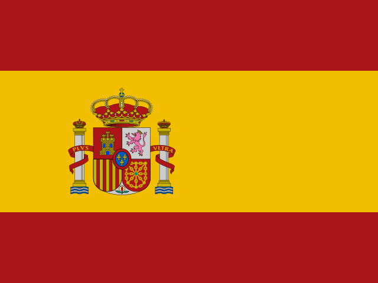

<!-- lang-selector -->
<p align="center">
  <a href="VSCODE-COPILOT.md"></a>&nbsp;
  <a href="VSCODE-COPILOT.fr.md"></a>&nbsp;
  <a href="VSCODE-COPILOT.de.md"></a>&nbsp;
  <a href="VSCODE-COPILOT.es.md"></a>&nbsp;
  <a href="VSCODE-COPILOT.pt.md"></a>&nbsp;
  <a href="VSCODE-COPILOT.ru.md"></a>&nbsp;
  <a href="VSCODE-COPILOT.zh-cn.md"></a>
</p>
<!-- /lang-selector -->

# Utiliser le serveur MCP de Poznote avec VS Code Copilot

Ce guide explique comment configurer et utiliser le serveur MCP de Poznote avec VS Code Copilot.

## Prérequis

- Visual Studio Code installé
- **Abonnement GitHub Copilot :** un forfait [GitHub Copilot](https://github.com/features/copilot) payant (ou en période d'essai) est nécessaire, avec l'extension Copilot Chat activée dans VS Code
- Le serveur MCP de Poznote en fonctionnement (via Docker Compose)
- Le serveur MCP accessible sur 127.0.0.1 (port par défaut : 8045)

## Configuration

### 1. Vérifier que le serveur MCP tourne

Vérifiez que le conteneur de votre serveur MCP est en cours d'exécution :

```bash
docker ps | grep mcp
```

Le serveur MCP doit apparaître comme en cours d'exécution. Notez le numéro de port indiqué dans la sortie (8045 par défaut).

### 2. Configurer VS Code

Ajoutez le serveur MCP de Poznote à votre fichier `mcp.json`. Son emplacement dépend de votre système d'exploitation :

- **Windows :** `C:\Users\YOUR-USERNAME\AppData\Roaming\Code\User\mcp.json`
- **Linux :** `~/.config/Code/User/mcp.json`
- **macOS :** `~/Library/Application Support/Code/User/mcp.json`

Si le fichier n'existe pas, créez-le avec la configuration suivante :

```json
{
  "servers": {
    "poznote": {
      "type": "http",
      "url": "http://127.0.0.1:8045/mcp"
    }
  }
}
```

> **Remarque :** remplacez `8045` par le port réel de votre serveur MCP si vous l'avez personnalisé dans votre `docker-compose.yml`.

#### Utiliser un jeton d'authentification

Si le serveur MCP a été démarré avec `POZNOTE_MCP_AUTH_TOKEN` (voir [Jeton d'authentification entrant](MCP-SERVER.fr.md#jeton-dauthentification-entrant)), ajoutez l'en-tête correspondant, sinon chaque appel est rejeté avec `401 Unauthorized` :

```json
{
  "servers": {
    "poznote": {
      "type": "http",
      "url": "http://127.0.0.1:8045/mcp",
      "headers": {
        "Authorization": "Bearer YOUR_TOKEN"
      }
    }
  }
}
```

Pour ne pas laisser le jeton dans `mcp.json`, VS Code peut vous le demander à la place : déclarez une entrée `inputs` avec `"password": true` et référencez-la sous la forme `"Authorization": "Bearer ${input:poznote-token}"`.

### 3. Recharger VS Code

Après avoir modifié `mcp.json`, rechargez VS Code pour que les changements prennent effet :
- Appuyez sur `Ctrl+Shift+P` (ou `Cmd+Shift+P` sur Mac)
- Tapez « Reload Window » et appuyez sur Entrée

## Configuration d'un serveur distant

Si votre instance Poznote tourne sur un serveur distant, utilisez une redirection de port SSH pour vous connecter de manière sécurisée.

### 1. Établir le tunnel SSH

Si vous préférez la ligne de commande, créez un tunnel SSH classique :

```bash
ssh -L 8045:127.0.0.1:8045 user@your-server
```

Laissez cette connexion ouverte tant que vous utilisez VS Code Copilot avec Poznote.

Si vous êtes déjà connecté à la machine distante via VS Code Remote SSH, Dev Containers ou Codespaces, vous pouvez aussi créer le tunnel directement depuis VS Code, dans la vue `PORTS` :

1. Ouvrez le panneau `PORTS` dans VS Code.
2. Redirigez le port distant `8045`.
3. Laissez le port redirigé actif tant que vous utilisez Copilot.
4. Si VS Code attribue un port local autre que `8045`, utilisez ce port local dans `mcp.json`.

### 2. Configurer VS Code

Utilisez la même configuration `mcp.json` que pour une installation locale :

```json
{
  "servers": {
    "poznote": {
      "type": "http",
      "url": "http://127.0.0.1:8045/mcp"
    }
  }
}
```

Le tunnel SSH ou le port redirigé par VS Code rend le serveur MCP distant accessible sur votre machine locale : VS Code se connecte donc à `127.0.0.1`.

## Exemples d'utilisation

Une fois la configuration faite, vous pouvez interagir avec votre instance Poznote directement depuis VS Code, en langage naturel dans Copilot Chat :

### Opérations de base

```
# Lister toutes les notes
@poznote Liste toutes mes notes

# Rechercher des notes
@poznote Recherche les notes qui parlent de "docker"

# Obtenir une note précise
@poznote Montre-moi la note 123

# Lister les espaces de travail
@poznote Quels espaces de travail ai-je ?

# Lister les dossiers
@poznote Montre-moi tous les dossiers de mon espace de travail
```

### Créer et modifier des notes

> **Espace de travail** : si vous ne précisez pas l'espace de travail dans votre requête, la note est créée dans l'espace de travail par défaut de l'utilisateur connecté. Nommez explicitement l'espace de travail cible pour éviter toute confusion, par exemple : *« dans l'espace de travail 'Projets' »*.

```
@poznote Crée une note intitulée "Meeting Notes" dans l'espace de travail "Projets" avec un contenu sur la nouvelle fonctionnalité

@poznote Mets à jour la note 456 avec un nouveau contenu sur le processus de déploiement

@poznote Supprime la note 456 (elle est mise à la corbeille)

@poznote Crée une note "Renew passport" dans l'espace de travail "Perso" et programme-moi un rappel le 1er septembre à 9 h

@poznote Crée un dossier nommé "Projects"
```

### Rappels

```
@poznote Rappelle-moi la note 123 lundi prochain à 8 h

@poznote Définis un rappel hebdomadaire sur la note 123, tous les lundis à 9 h

@poznote La note 123 a-t-elle un rappel ?

@poznote Supprime le rappel de la note 123
```

### Listes de tâches

```
@poznote Montre-moi les tâches de la note 123

@poznote Ajoute à la note 123 une tâche "Buy milk" à faire pour demain 18 h 30, avec un rappel

@poznote Ajoute une tâche "Weekly report" à la note 123, à faire tous les vendredis

@poznote Marque la tâche "Buy milk" de la note 123 comme terminée

@poznote Repousse l'échéance de la tâche "Buy milk" de la note 123 à lundi prochain

@poznote Supprime la tâche "Buy milk" de la note 123
```

### Opérations avancées

```
@poznote Duplique la note 789

@poznote Ajoute la note 123 aux favoris

@poznote Déplace la note 456 dans le dossier "Projects"

@poznote Convertis la note 123 en Markdown

@poznote Quelles notes pointent vers la note 123 ?

@poznote Active le partage public de la note 123

@poznote Liste toutes mes notes et tous mes dossiers partagés publiquement

@poznote Quelle version de Poznote est-ce que j'utilise ?
```

### Dossiers et espaces de travail

```
@poznote Renomme le dossier 12 en "Archive"

@poznote Supprime le dossier 12 et mets ses notes à la corbeille

@poznote Crée un espace de travail nommé "Work"

@poznote Renomme l'espace de travail "Work" en "Job"

@poznote Supprime l'espace de travail "Job"
```

### Corbeille et restauration

```
@poznote Montre-moi toutes les notes de la corbeille

@poznote Restaure la note 123 depuis la corbeille

@poznote Vide la corbeille
```

### Synchronisation Git

```
@poznote Où en est la synchronisation Git ?

@poznote Envoie mes notes vers Git

@poznote Récupère les notes depuis Git
```

### Sauvegardes et paramètres

```
@poznote Liste toutes les sauvegardes

@poznote Crée une sauvegarde de mes données

@poznote Restaure la sauvegarde poznote_backup_2026-02-02_15-30-00.zip

@poznote Supprime la sauvegarde poznote_backup_2026-02-02_15-30-00.zip

@poznote Quelle est la valeur du paramètre "timezone" ?

@poznote Règle le paramètre "timezone" sur "Europe/Paris"
```

### Travailler avec le contenu

```
@poznote Peux-tu résumer toutes mes notes qui ont le tag "important" ?

@poznote Aide-moi à organiser mes notes en dossiers selon leurs sujets

@poznote Crée un rapport hebdomadaire à partir de mes notes de réunion
```

## Dépannage

### Problèmes de connexion

Si VS Code Copilot ne parvient pas à se connecter au serveur MCP :

1. **Vérifiez que le serveur MCP tourne :**
   ```bash
   curl http://127.0.0.1:8045/mcp
   ```
   (Remplacez `8045` par le port que vous avez configuré)

2. **Vérifiez l'état du conteneur Docker :**
   ```bash
   docker ps | grep mcp
  docker compose logs mcp-server
   ```

3. **Vérifiez la publication du port :**
   Assurez-vous que le port est lié à 127.0.0.1 dans `docker-compose.yml` :
   ```yaml
   ports:
     - "127.0.0.1:${POZNOTE_MCP_PORT:-8045}:8045"
   ```

4. **Vérifiez la syntaxe de mcp.json :**
   Assurez-vous que votre JSON est valide (pas de virgule finale, guillemets corrects, etc.)

### Serveur MCP non reconnu

Si VS Code ne reconnaît pas le serveur MCP de Poznote :

1. Vérifiez que vous avez rechargé VS Code après avoir modifié `mcp.json`
2. Vérifiez que GitHub Copilot est activé et actif
3. Recherchez d'éventuels messages d'erreur dans le panneau de sortie de VS Code :
   - View → Output
   - Sélectionnez « GitHub Copilot » dans la liste déroulante

### Erreurs d'authentification

Le serveur MCP s'authentifie auprès de Poznote avec le jeton partagé stocké dans `data/.mcp_token`.

Vérifiez ces points :
- `./data/.mcp_token` existe sur l'hôte Poznote
- le service `mcp-server` monte `./data:/var/www/html/data:ro`
- le conteneur webserver a été recréé au moins une fois après la mise à jour vers la configuration MCP à base de jeton

### Mode débogage

Activez les logs de débogage du serveur MCP en recréant le conteneur avec une variable d'environnement passée sur la ligne de commande :

```bash
POZNOTE_DEBUG=true docker compose up -d --force-recreate mcp-server
```

Seules les valeurs exactes en minuscules `true` et `false` sont reconnues. Toute autre valeur est traitée comme `false` et un avertissement est écrit dans les logs MCP.

Consultez ensuite les logs :
```bash
docker compose logs -f mcp-server
```

## Outils MCP disponibles

Le serveur MCP de Poznote fournit les outils suivants, que VS Code Copilot peut utiliser :

### Gestion des notes
- `get_note` : obtenir une note précise par son ID
- `list_notes` : lister toutes les notes
- `search_notes` : rechercher des notes par texte, avec une plage de dates de création facultative
- `create_note` : créer une note, éventuellement avec une date d'échéance ou un rappel
- `update_note` : mettre à jour une note existante et/ou définir sa date d'échéance ou son rappel
- `delete_note` : supprimer une note
- `duplicate_note` : dupliquer une note
- `convert_note` : convertir une note entre HTML et Markdown
- `get_backlinks` : obtenir les notes qui pointent vers une note

### Rappels
- `get_reminder` : obtenir le rappel défini sur une note
- `set_reminder` : définir ou remplacer le rappel d'une note, avec un intervalle de répétition facultatif
- `remove_reminder` : supprimer le rappel d'une note

### Tâches
- `list_tasks` : lister les tâches d'une liste de tâches, avec leurs ID et leurs dates d'échéance
- `add_task` : ajouter une tâche, avec une date d'échéance et un rappel facultatifs
- `update_task` : mettre à jour une tâche (texte, date d'échéance, rappel, indicateur important)
- `complete_task` : marquer une tâche comme terminée, ou la rouvrir
- `delete_task` : supprimer une tâche d'une liste de tâches

### Organisation
- `create_folder` : créer un dossier
- `list_folders` : lister tous les dossiers
- `rename_folder` : renommer un dossier
- `delete_folder` : supprimer un dossier et mettre ses notes à la corbeille
- `list_workspaces` : lister tous les espaces de travail
- `create_workspace` : créer un espace de travail
- `rename_workspace` : renommer un espace de travail
- `delete_workspace` : supprimer un espace de travail (impossible de supprimer le dernier)
- `list_tags` : lister tous les tags
- `move_note_to_folder` : déplacer une note dans un dossier
- `remove_note_from_folder` : retirer une note d'un dossier
- `toggle_favorite` : ajouter aux favoris ou en retirer

### Gestion de la corbeille
- `get_trash` : lister les notes de la corbeille
- `restore_note` : restaurer depuis la corbeille
- `empty_trash` : vider la corbeille

### Partage
- `share_note` : activer le partage public
- `unshare_note` : désactiver le partage public
- `get_note_share_status` : obtenir l'état du partage
- `list_shared` : lister toutes les notes et tous les dossiers partagés publiquement

### Pièces jointes
- `list_attachments` : lister les pièces jointes d'une note

### Synchronisation Git
- `get_git_sync_status` : obtenir l'état de la synchronisation Git
- `git_push` : envoyer vers le dépôt Git
- `git_pull` : récupérer depuis le dépôt Git

### Système
- `get_system_info` : obtenir les informations de version de Poznote
- `list_backups` : lister les sauvegardes système
- `create_backup` : créer une sauvegarde
- `restore_backup` : restaurer une sauvegarde (remplace les données actuelles de l'utilisateur)
- `delete_backup` : supprimer un fichier de sauvegarde
- `get_app_setting` : obtenir un paramètre de l'application
- `update_app_setting` : modifier un paramètre de l'application

### Prise en charge multi-utilisateur

La plupart des outils acceptent un paramètre facultatif `user_id` pour cibler un profil utilisateur précis. Les exceptions sont les outils système `get_system_info`, `list_backups`, `create_backup` et `delete_backup`, qui ne prennent pas `user_id`. Vous pouvez l'indiquer dans vos requêtes :

```
@poznote Liste les notes de l'utilisateur 2
```

## Configuration avancée

### Plusieurs instances de Poznote

Si vous faites tourner plusieurs instances de Poznote, vous pouvez les configurer sous des noms différents :

```json
{
  "servers": {
    "poznote-personal": {
      "type": "http",
      "url": "http://127.0.0.1:8045/mcp"
    },
    "poznote-work": {
      "type": "http",
      "url": "http://127.0.0.1:9045/mcp"
    }
  }
}
```

Référencez-les ensuite explicitement :
```
@poznote-work Liste mes notes professionnelles
```

### Configuration d'un port personnalisé

Si votre serveur MCP tourne sur un autre port, modifiez l'URL dans `mcp.json` :

```json
{
  "servers": {
    "poznote": {
      "type": "http",
      "url": "http://127.0.0.1:YOUR_PORT/mcp"
    }
  }
}
```

## Remarques sur la sécurité

⚠️ **Important :** quiconque peut joindre le point de terminaison MCP peut gérer toutes les notes. Par défaut, il n'est joignable que depuis 127.0.0.1 ; si vous l'exposez davantage, définissez `POZNOTE_MCP_AUTH_TOKEN` pour que les clients doivent présenter un jeton bearer (voir [Utiliser un jeton d'authentification](#utiliser-un-jeton-dauthentification)).

**Configuration par défaut (sécurisée) :**
```yaml
ports:
  - "127.0.0.1:8045:8045"  # Only accessible from 127.0.0.1
```

**Pour un accès distant, utilisez toujours un tunnel SSH**, comme décrit dans la section [Configuration d'un serveur distant](#configuration-dun-serveur-distant).

Tous les détails : [Sécurité du serveur MCP](MCP-SERVER.fr.md#sécurité).

## Ressources

- [Documentation principale du serveur MCP](MCP-SERVER.fr.md)
- [Documentation officielle de VS Code sur MCP](https://code.visualstudio.com/docs/copilot/customization/mcp-servers)
- [Configuration de Claude CLI](CLAUDE-CLI.fr.md)
- [Considérations de sécurité](MCP-SERVER.fr.md#sécurité)

## Support

Pour tout problème ou toute question :
- Consultez la [documentation MCP principale](MCP-SERVER.fr.md)
- Examinez les logs du serveur MCP : `docker compose logs mcp-server`
- Vérifiez que l'API Poznote est accessible
- Recherchez les erreurs dans le panneau de sortie de VS Code
